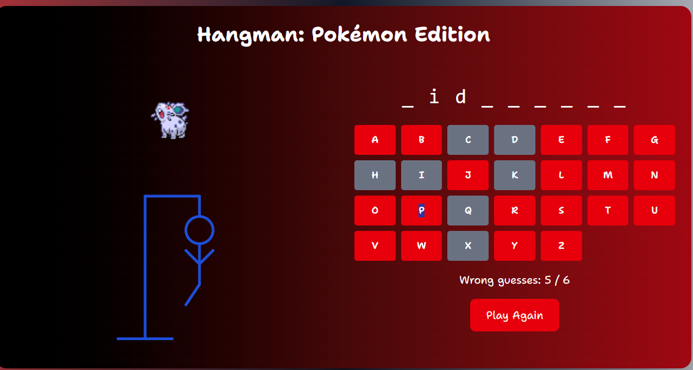

# POKIVERSE — Pokemon Themed Fun Games (React + Vite) ⚡️

<p align="center">
  
</p>

> A premium pokemon-themed gaming hub built with **React** and **Vite**. Experience high-energy mini-games including **PokeLudo**, **Hangman**, **PokeCrush**, and **Memorite**.

<p align="center">
  <table align="center">
    <tr>
      <td></td>
      <td></td>
    </tr>
    <tr>
      <td></td>
      <td></td>
    </tr>
  </table>
</p>

---

## 🚀 Key Features

- **Responsive** UI that looks great on desktop and mobile
- **Fast development** with Vite HMR and minimal setup
- **ESLint** + sensible defaults for clean code

---

## ⚙️ Local Setup

1. Install dependencies

```bash
npm install
# or
yarn
```

2. Run the dev server

```bash
npm run dev
# or
yarn dev
```

3. Build for production

```bash
npm run build
# or
yarn build
```

4. Preview the production build

```bash
npm run preview
# or
yarn preview
```

---

## 🗂️ Project Structure (high level)

- `index.html` — app entry
- `src/` — React components and styles
- `public/` — static assets
- `package.json` — scripts & dependencies

---

## 🕹️ Premium Gaming About Page
<p align="center">
  
</p>
<p align="center"><i>Featuring high-end animations and a futuristic Pokedex-themed interface.</i></p>

---

## 🛠️ Technologies

- **React** (v19) — UI library
- **Vite** — dev server & build tooling
- **Tailwind CSS** — utility-first CSS framework
- **GSAP** & **@gsap/react** — animations
- **axios** — HTTP client for API requests
- **react-router-dom** — client-side routing
- **lucide-react** — icon set
- **react-responsive** — responsive helpers
- **ESLint** + related plugins — linting and code quality

---

## 🤝 Contributing

Contributions are welcome! If you add features or polish the UI, please open a PR with a short description of your changes.

---

## 📄 License

This project uses the default repository license. Add a `LICENSE` file or update this section with your preferred license.

---


