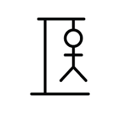

# POKIVERSE — Pokemon Themed Fun Games  ⚡️

<p align="center">
  
</p>

> A premium pokemon-themed gaming hub built with **React** and **Vite**. Experience high-energy mini-games including **PokeLudo**, **Hangman**, **PokeCrush**, and **Memorite**.

<p align="center">
  <table align="center">
    <tr>
      <td></td>
      <td></td>
    </tr>
    <tr>
      <td></td>
      <td></td>
    </tr>
  </table>
</p>

---

## 🚀 Game Highlights

- **PokeLudo**: A strategic 4-player board game. Choose your starter Pokémon and race to the finish line with custom turn-based mechanics.
- **PokeCrush**: Fast-paced match-3 puzzle action. Trigger powerful Pokémon combos and clear the board.
- **Hangman**: Test your Pokémon knowledge! Guess the names correctly to save your Pokémon companions.
- **Memorite**: Sharpen your mind with this Pokémon card-matching memory challenge.

---

## 🛠️ Key Features

- **Premium UI**: Dark-themed, high-energy gaming aesthetic with GSAP animations.
- **Responsive Design**: Fully optimized for mobile, tablet, and desktop gaming.
- **Smooth Performance**: Built on React 19 + Vite for ultra-fast load times and HMR.
- **Pokedex About Page**: Interactive and animated informational section.

---

## 🗂️ Project Structure

```text
pokiverse/
├── public/                # Global static assets (videos, game assets)
│   ├── images/            # Game thumbnails and icons
│   └── videos/            # High-quality background visuals
├── src/
│   ├── components/        # Game modules & UI sections
│   │   ├── ludo.jsx       # Consolidated Ludo core
│   │   ├── games.jsx      # Dynamic games lobby
│   │   └── ...            # Modular UI components
│   ├── App.jsx            # Core routing and global state
│   ├── index.css          # Tailwind & custom design tokens
│   └── main.jsx           # Application entry point
├── package.json           # Dependencies and build scripts
└── README.md              # Project documentation
```

---

## 🛠️ Technologies

- **React** (v19) — UI library
- **Vite** — High-performance build tool
- **Tailwind CSS** — Modern styling framework
- **GSAP** & **@gsap/react** — Professional-grade animations
- **Lucide React** — Premium icon set

---

## 🤝 Contributing

Contributions are always welcome! Feel free to fork the repo and submit PRs for new games or UI polish.

---

## 📄 License & Credits

Distributed under the **MIT License**. See `LICENSE` for more information.  
*Pokémon assets are used for educational/fan purposes.*

---


